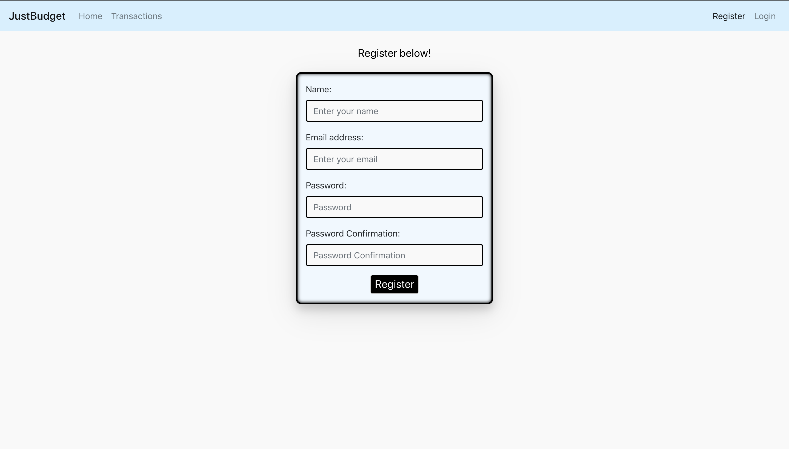
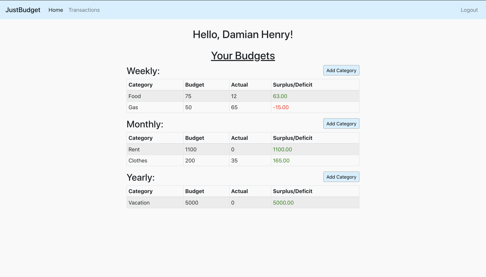
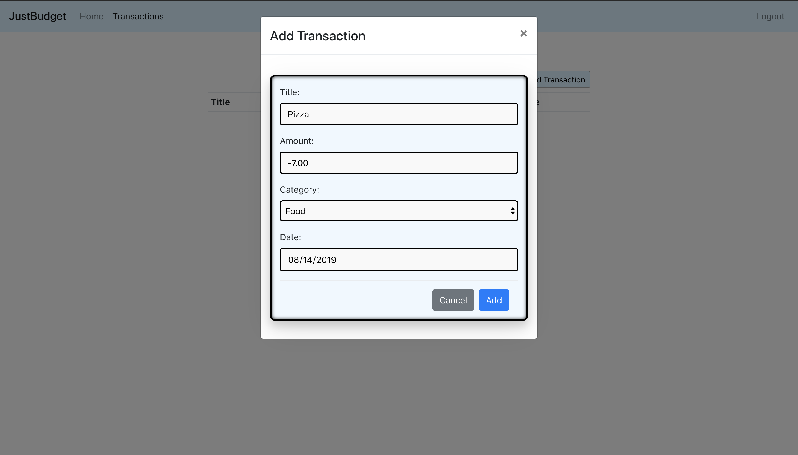

# justbudget

JustBudget is a MERN stack budgeting web application where users can manage their personal finances on the weekly, monthly, and yearly levels.

- Users can register an account 

- Users can personalize their budgets with categories

- Users can add transactions to update their budgets

